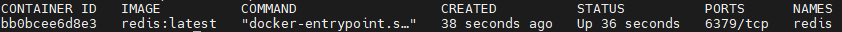

# Docker Command

자주 사용하는 docker 명령어 정리와 기록

## image 관련

### 이미지 검색 (search)

Docker Hub에 공개되어있는 이미지를 검색

``` console title="docker search [검색할 이미지명]"
docker search redis
```
    <div class="result" markdown>
        <figure markdown>
        
        </figure>
    </div> 


### 이미지 다운로드 (pull)

Docker Hub에서 이미지를 로컬로 다운로드

``` console title="docker pull [이미지명]"
docker pull redis
```
    <div class="result" markdown>
        <figure markdown>
        
        </figure>
    </div> 

이미지의 tag 명을 명시할경우 해당 tag 이미지만 다운로드 받음

``` console title="docker pull [이미지명]:[tags]"
docker pull redis:6.2.3
```

### 이미지 목록 (images)

docker 로컬에 저장된 이미지 목록

``` console title="docker images"
docker images
```
    <div class="result" markdown>
        <figure markdown>
        
        </figure>
    </div> 


### 이미지 삭제 (rm, prune)

저장된 docker 이미지를 삭제

``` console title="docker image rm [REPOSITORY]:[TAG]"
docker image rm redis:6.2.3
```

또는 이미지 ID 를 이용하여 삭제 
``` console title="docker image rm [IMAGE ID]"
docker image rm bc8d70f9ef6c
```

사용하지 않는 docker 이미지를 한번에 삭제 할 수 있음
``` console title="docker image prune [OPTION]"
docker image prune -af
```

!!! warning
    현재 이미지로 구동중인 container 가 존재할 경우 container 중지 > container 삭제 > 이미지 삭제 순서로 진행해야 함


## 실행 관련

### docker run

이미지를 실행시키기 위해 docker run 을 할 경우 이미지를 실행할 가상 container가 기본적으로 생성되며 가상 container 환경에서 내부적으로 구동된다.

``` console title="docker run [이미지명] (또는 [IMAGE ID])"
docker run redis:latest
```

!!! tip 
    docker 명령어 옵션에 이미지명이 포함되는 경우 해당 이미지명은 docker images 명령어를 실행 시 나오는 결과의 REPOSITORY와 TAG의 조합이다. docker image를 받기위해 docker pull 명령어 옵션에 이미지명:tag 와 같은 맥락이다


#### 백그라운드 실행

단순히 docker run 에 추가 옵션이 없이 실행할 경우 현재 세션에서 docker image 가 실행되기 때문에 백그라운드에서 실행하는 옵션을 부여한다.

``` console title="docker run -d [이미지명]"
docker run -d redis:latest
```

#### name 옵션

docker run 에 name 옵션을 지정하지 않고 구동할 경우 구동된 container 명이 임의의 이름으로 생성된다. 추후 docker container를 조작할 경우 임의의 container 명 때문에 번거로울 수 있으니 run 명령어에 name 옵션을 추가하는 것을 권장함.

``` console title="docker run -d --name [container명] [이미지명]"
docker run -d --name redis redis:latest
```

### docker container

#### 도커 프로세스 상태 (ps)

현재 구동중인 docker container의 목록 및 상태를 조회 할 수 있다.

``` console
docker ps
```
    <div class="result" markdown>
        <figure markdown>
        
        </figure>
    </div> 

ps 명령어에 -a 옵션을 붙이면 실행중인 container가 아닌 기존에 종료된 container 목록도 조회

``` console
docker ps -a
```
    <div class="result" markdown>
        <figure markdown>
        
        </figure>
    </div> 

#### 시작과 종료

docker ps -a 명령어를 이용하여 모든 container 목록 및 상태를 우선 확인

!!! info
    docker container ls 명령어가 존재하지만 docker ps 와 동일하게 container 목록을 보여주는 기능이며 동일하다.

container 중지

``` console title="docker stop [container명]"
docker stop redis
```

container 시작

``` console title="docker start [container명]"
docker start redis
```

#### container 삭제

삭제할려는 container를 중지 한 후 삭제

``` console title="docker rm [container명]"
docker rm redis
```

중지된 모든 container 일괄 삭제

``` console 
docker container prune
```

모든 container 일괄 삭제 (실행중인 container도 삭제한다)

``` console 
docker rm -f $(docker ps -aq)
```


@@@ docker exec

//별도 md로 뺄것들

@@@ dockerFile
@@@ centos user가  polkit 실행되는 문제


 
