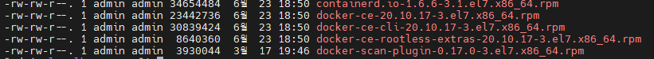
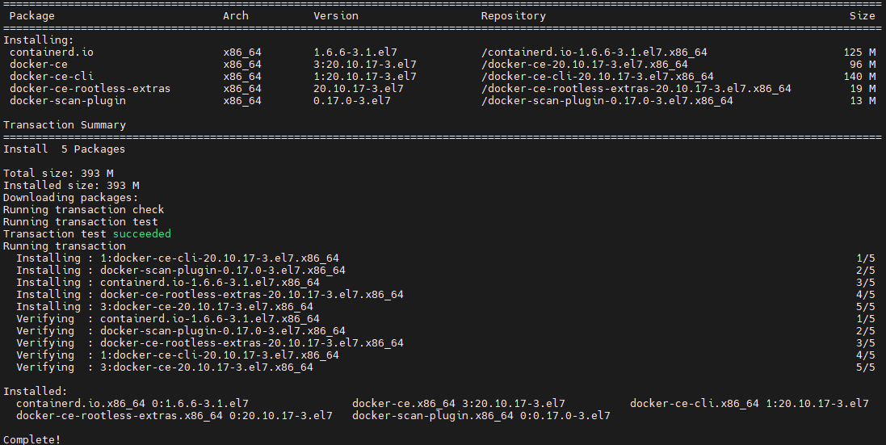
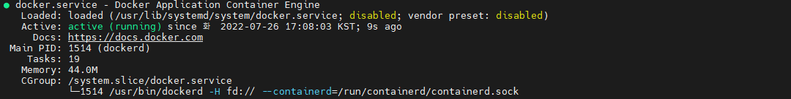

# Manual installation of docker

리눅스 환경에서 Docker 설치는 docker repository 를 등록 후 설치하는 방식과 수동으로 rpm을 내려받아 설치하는 방식이 있으며, 본문에서는 docker rpm 을 다운로드 받아 설치하는 과정을 기록함.

## docker rpm download

yumdownloader를 이용하여 rpm 다운로드

``` console 
yumdownloader --resolve docker-ce
```
    <div class="result" markdown>
        <figure markdown>
        
        </figure>
    </div> 


## docker rpm 설치

``` console title="docker rpm install"
yum localinstall -y *.rpm
```
    <div class="result" markdown>
        <figure markdown>
        
        </figure>
    </div> 


## docker start 

``` console title="docker start"
systemctl start docker
```
``` console title="docker status"
systemctl start docker
```
    <div class="result" markdown>
        <figure markdown>
        
        </figure>
    </div> 


