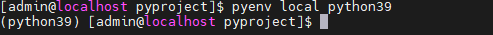

# pyenv

로컬 환경에서의 python 버전을 관리해주는 프로그램 

!!! note "pyenv github"
    https://github.com/pyenv/pyenv


## Install

### Linux

CentOS 에서 pyenv 설치과정 기록

``` console title="의존성 패키지 설치"
sudo yum install -y bzip2 bzip2-develcurl gcc gcc-c++ git libffi-devel make openssl-devel readline-devel sqlite sqlite-devel xz xz-devel zlib-devel
```

의존성 패키지 설치 후 공식 레포에서 바이너리 받아서 설치

``` console
curl -L https://github.com/pyenv/pyenv-installer/raw/master/bin/pyenv-installer | bash
```

설치완료 후 PATH 설정이 필요하다는 문구가 나오는데 아래와 같이 작업

``` bash title="vi ~/.bash_profile"
PATH="$HOME/.pyenv/bin:$PATH"
eval "$(pyenv init -)"
eval "$(pyenv virtualenv-init -)"
```

``` console
source ~/.bash_prfile
```


### Windows

공식적으로 윈도우 환경에서는 pyenv를 지원하지 않으며 포크된 pyenv-win을 이용하서 설치
진행

!!! note "pyenv-win"
    https://github.com/pyenv-win/pyenv-win


PowerShell을 이용하여 설치 스크립트를 다운로드 받아 실행

``` PowerShell title="pyenv-win"
Invoke-WebRequest -UseBasicParsing -Uri "https://raw.githubusercontent.com/pyenv-win/pyenv-win/master/pyenv-win/install-pyenv-win.ps1" -OutFile "./install-pyenv-win.ps1"; &"./install-pyenv-win.ps1"
```

!!! warning "UnauthorizedAccess 에러"
    설치 시 UnauthorizedAccess 에러를 뱉은 경우 PowerShell을 관리자 모드로 실행한다음 아래의 명령어를 수행 후 다시 설치 스크립트 실행
    ``` PowerShell
    Set-ExecutionPolicy -ExecutionPolicy RemoteSigned -Scope LocalMachine
    ```

## Command


``` console title="특정 버전 python 설치 (삭제는 uninstall)"
pyenv install 3.7.5
```


``` console title="관리되는 python 버전 목록"
pyenv versions
```

``` console title="버전 스위칭"
pyenv global 3.7.5
```

격리된 가상환경 (virtualenv)을 디렉토리별로 지정하여 프로젝트별 python 버전을 각기 다르게 구성할 수 있다.

``` console title="3.9.13 python 버전을 설치"
pyenv install 3.9.13
```

``` console title="3.9.13버전의 virtualenv 생성"
pyenv virtualenv 3.9.13 python39
```

``` console title="특정 폴더에 virtualenv 적용"
pyenv local python39
```
    <div class="result" markdown>
        <figure markdown>
        
        </figure>
    </div> 

