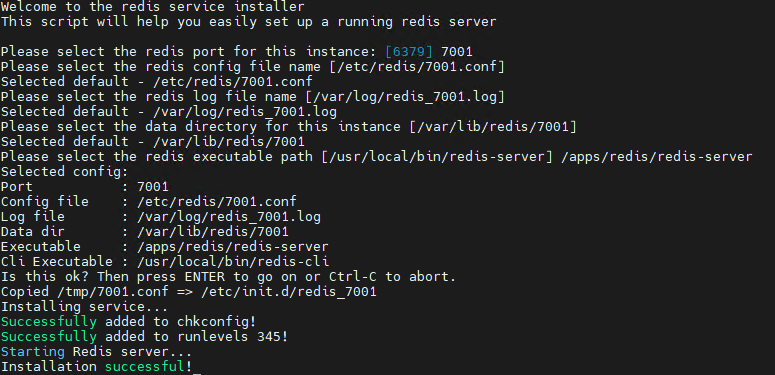

# Redis Install

레디스는 docker로 구동해서 쉽게 설치 구성하였는데 프로덕션 환경에서 구성하기 애매한 부분이  
존재함..  ex) 폐쇠망, 가상 인스턴스가 아닌 환경  
  
단순하지만 공식 사이트에서 바이너리를 다운로드 받아 오프라인 환경 수동설치 기록을 남기기 위해 작성

## Environment

CentOS 7에서 redis 를 설치 진행
???+ warning
    redis 바이너리를 컴파일 해야하기 때문에 gcc가 필수로 설치 되어야함
    ```
    yum install gcc
    ```

## Redis download & compile

``` bash title="1. Redis Stable 다운로드"
    wget http://download.redis.io/redis-stable.tar.gz
```

``` bash title="2. 압축풀고 컴파일"
    tar xvzf redis-stable.tar.gz
    cd redis-stable
    make
    make install
```

``` bash title="3. src 폴더를 특정 위치로 복사 또는 이동"
    cp ./src/ /apps/redis -R
```

## Redis config init

redis-stable 폴더 내 utils 폴더 안에 install_server.sh 를 실행하면 초기 redis 설치 경로 지정 redis.conf, 서버 실행 스크립트등을 생성함  

```  title="redis-stable/utils/install.sh"
cd utils
sh install_server.sh
```  

현재 stable 버전의 install_server.sh 실행시 아래의 에러가 발생한다.

```
This script will help you easily set up a running redis server

This systems seems to use systemd.
Please take a look at the provided example service unit files in this directory, and adapt and install them. Sorry!

```

대략 systemd를 사용하는 환경에서는 utils 폴더 안에 systemd service 샘플을 수정해서 직접  
서비스 등록 하라는 말.. 그냥 install_server.sh 를 편집해서 강제 실행 가능하도록 스크립트를  
변경함

``` bash title="install_server.sh (77~84라인 주석처리)" hl_lines="8 9 10 11 12 13 14 15"
#check for root user
...
if [ "$(id -u)" -ne 0 ] ; then
        echo "You must run this script as root. Sorry!"
        exit 1
fi

#bail if this system is managed by systemd
#_pid_1_exe="$(readlink -f /proc/1/exe)"
#if [ "${_pid_1_exe##*/}" = systemd ]
#then
#        echo "This systems seems to use systemd."
#        echo "Please take a look at the provided example service unit files in directory, and adapt and install them. Sorry!"
#        exit 1
#fi
#unset _pid_1_exe

if ! echo $REDIS_PORT | egrep -q '^[0-9]+$' ; then
        _MANUAL_EXECUTION=true
...
```  

스크립트 변경 후 install_server.sh 를 실행하여 포트 및 redis 경로등을 지정함

<figure markdown>
  
  <figcaption>install_server 설정 구성 후 결과</figcaption>
</figure>


