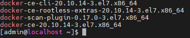

# Package 관련 명령어

평상시 프로그램 패키지를 yum 또는 apt 명령어를 이용하여 자동 설치를 했기 때문에 항상 쓰는
명령어는 손에 잘 익지만 그 외 관리,삭제등은 잘 안쓰게 되어 필요할때 인터넷 검색을 하게 됨..
그래서 필요한 명령어 위주로 기록함

!!! note

    CentOs 환경에서의 패키지 명령어


## 패키지 확인

### 설치된 패키지 확인

=== "rpm"

    ``` console title="rpm 설치된 패키지 목록"
    rpm -qa
    ```
    <div class="result" markdown>
        <figure markdown>
        
        </figure>
    </div> 

=== "yum"

    ``` console title="yum 설치된 패키지 목록"
    yum list installed
    ```
    <div class="result" markdown>
        <figure markdown>
        
        </figure>
    </div>    
    

<!-- <div class="result" markdown>
<figure markdown>

<figcaption>OS에 설치된 모든 패키지 목록</figcaption>
</figure>
</div> -->

### 특정 패키지 검색

설치된 패키지 중 docker가 설치되어 있는지 확인

=== "rpm"

    ``` console title="rpm 특정 패키지 검색"
    rpm -qa | grep docker
    ```
    <div class="result" markdown>
        <figure markdown>
        
        </figure>
    </div> 

=== "yum"

    ``` console title="yum 특정 패키지 검색"
    yum list installed | grep docker
    ```
    <div class="result" markdown>
        <figure markdown>
        
        </figure>
    </div> 


## 특정 패키지 삭제

### yum remove

``` console title="yum remove {package}"
yum remove docker-ce.x86_64
```

### rpm -e

``` console title="rpm -e {package}"
rpm -e docker-ce.x86_86
```

!!! warning 
    
    삭제가 정상적으로 안될경우 패키지 의존성과 관련된 문제인데  삭제할 패키지의
    상위 패키지를 우선 삭제하거나  --nodeps 를 이용하여 의존성 검사를 무시하고 삭제한다 

    ``` console title="rpm -e {package} --nodeps"
    rpm -e docker-ce.x86_86 --nodeps
    ```


